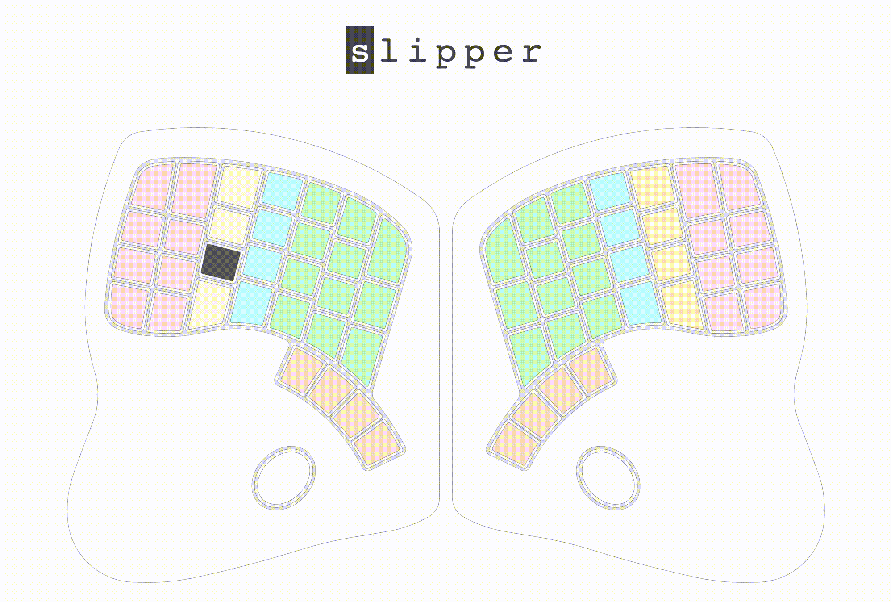

# seeboard

A visual tool to practise touch typing.

Given a random text for you to type, highlights the current target key and the keys you type, so that if you miss the target you can see how far you are and adjust without looking at the keyboard.

It doesn't show symbols on keys intentionally, to help you remember their position.

Colors suggest the finger to use:

- green -> index
- cyan -> middle
- gold -> ring
- pink -> pinky (obviously :)
- brown -> thumb

## Usage

- Press `Enter` when you have completed the text,
- Press `PageUp` or `PageDown` to update the text and restart,

It currently shows the [Keyboard.io](https://shop.keyboard.io/) with QWERTY layout.

## Personalization

To configure your own layout:

- run `npm run dev`
- open [localhost:3000](http://localhost:3000)
- modify `src/app/components/Keyboardio/keyToChar.json`
- the page will refresh automatically after a new build.

## Contribute!

At the moment only meta keys and letters are working, no punctuation or other symbols.
You can help by opening issues or PRs to help completing this layout, sending new layouts (PRs, gists, pastebins, whatever it works is OK) or even just pointing me to new keyboards drawings, I can take care of turning them into Svelte components if you don't know how to do so.
We'll add some keyboard and/or layout selector in that case :)

Thanks!
